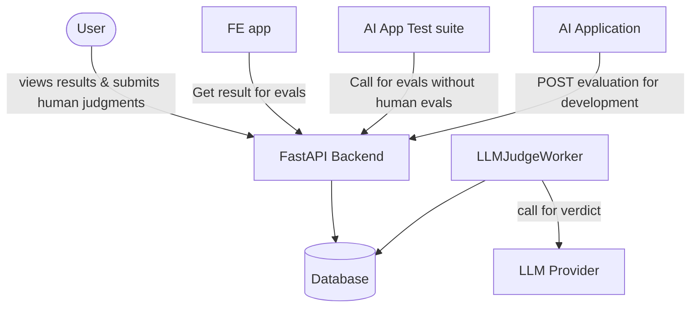

# How to run

To create a mock evaluation (simulate app call)

```shell
make eval
```

To run the judging of samples

```shell
make judge
```

To run API required for FE

```shell
make api
```

# Evaluation Framework Architecture

## Overview

Standalone evaluation service, decoupled from the application being evaluated.

## Separation of Concerns

```
App                          Evaluator Service
├── runs questions           ├── runs judges (human + LLM)
├── gets answers             ├── tracks judge costs
├── tracks app costs         ├── stores results
└── reports to evaluator     └── provides verdicts
```

## Entities

- App -- created for each application (not implemented yet)
- Evaluation -- created only for 1 app, contains metadata, app version etc, should created after every change in the app
- Sample -- tied to only 1 evaluation, contains the question, human & app anwers and some more metadata
- Judgment -- a sample can have many llm judgments and ONLY 1 human judgment, contains the verdict

## Data Flow (Single-turn Q&A)

1. App sends `{question, human_answer, app_answer, app_cost, metadata}` to evaluator
2. Evaluator runs N judges (human and/or LLM)
3. Results stored with verdicts, explanations
4. App queries results to track improvement

## Judge Calibration

- Human judges = gold standard (used heavily early on)
- LLM judges calibrated against human baseline
- Track agreement rate until LLM judges can run solo
- Periodic human spot-checks after graduation

## Deployment

Evaluator deployed as standalone service. Callable from:

- Local development
- Staging
- Production

## Architecture



Consists of a backend and fronend parts.

## Backend

FastAPI REST API. Stores prompts per-app for different LLM judging prompts.

### Design (Work Queue Pattern)

```
EvaluationService              LLMJudgeWorker
├── creates evaluations        ├── polls pending LLM judgments
├── creates pending judgments  ├── executes in parallel
└── returns immediately        └── marks complete

POST /sample/{sample_id}/judgment
└── completes human judgments (manual consumer)
```

- All judgments start as `pending`
- `LLMJudgeWorker` processes LLM judgments async
- Human judgments completed via API
- Evaluation complete when all judgments complete

## Frontend

Frontend part is PURELY for interacting with the human for judging and displaying result information.

## Components

repositories -- data access only, no business logic, no data transformation beyond mapping DB rows to base schemas
services -- business logic and validation
schemas -- always have up to 2 api schemas 1 for list returns and 1 for detail return

