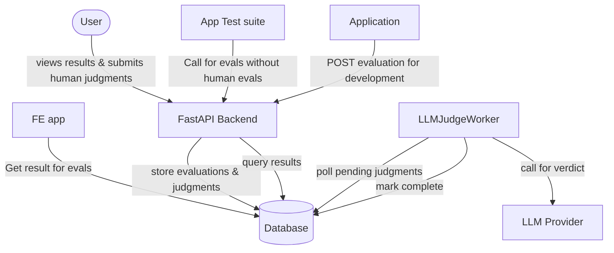

# Evaluation Framework Architecture

## Overview

Standalone evaluation service, decoupled from the application being evaluated.

## Separation of Concerns

```
App                          Evaluator Service
├── runs questions           ├── runs judges (human + LLM)
├── gets answers             ├── tracks judge costs
├── tracks app costs         ├── stores results
└── reports to evaluator     └── provides verdicts
```

## Data Flow (Single-turn Q&A)

1. App sends `{question, answer, app_cost, metadata}` to evaluator
2. Evaluator runs N judges (human and/or LLM)
3. Results stored with verdicts, scores, explanations
4. App queries results to track improvement

## Judge Calibration

- Human judges = gold standard (used heavily early on)
- LLM judges calibrated against human baseline
- Track agreement rate until LLM judges can run solo
- Periodic human spot-checks after graduation

## Judge Prompts

- **Generic** (shared): coherence, hallucination, relevance
- **App-specific** (configured per app): domain rules, tone, safety

## Deployment

Evaluator deployed as standalone service. Callable from:
- Local development
- Staging
- Production

# Evaluation app architecture



Consists of a backend and fronend parts.

## Backend

FastAPI REST API. Stores prompts per-app for different LLM judging prompts.

### Design (Work Queue Pattern)

```
EvaluationService              LLMJudgeWorker
├── creates evaluations        ├── polls pending LLM judgments
├── creates pending judgments  ├── executes in parallel
└── returns immediately        └── marks complete

POST /human-judgment
└── completes human judgments (manual consumer)
```

- All judgments start as `pending`
- `LLMJudgeWorker` processes LLM judgments async
- Human judgments completed via API
- Evaluation complete when all judgments complete

### API

Basic endpoints

```
POST evaluation
- contains questions/answers and metadata to evaluate
- called from the app that wants to evaluate its performance

GET evaluations
- returns history of evaluations
- called by FE

POST human-judgment
- called by FE, completes pending human judgments 
```


## Frontend

Frontend part is PURELY for interacting with the human for judging and displaying result information.


## Implementation plan

- create judge worker and parallelize
- create basic api
- human judge api 
- deploy
- basic FE for human judging